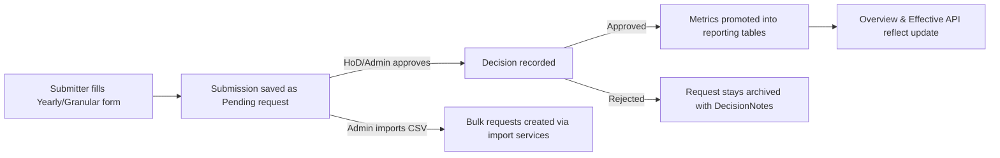

# Development Directions for ProjectOfficeReports Module

## 1. Purpose

We are creating a new module named **ProjectOfficeReports**. This module will hold different trackers and reports that are maintained by the Project Office.

The first tracker to be created under this module will be called **"Visits & Dignitary Tracker"**.

Later, other trackers and reports will also come under this same module.

---

## 2. User Roles and Permissions

| Role           | What they can do                                      |
| -------------- | ----------------------------------------------------- |
| Admin          | Can view, create, edit, delete, and manage Visit Types. |
| HoD            | Can view, create, edit, and delete Visits.            |
| ProjectOffice  | Can view, create, edit, and delete Visits.            |
| All other users (normal) | Can view only.                              |

**Important:**
- "ProjectOffice" is the correct role name (not ProjectOfficer).
- Only these three roles (Admin, HoD, ProjectOffice) will have editing rights.

---

## 3. What to Build (Overview)

Under **ProjectOfficeReports**, create a sub-module named **Visits**.

It will have:
1. Visit Types – defined by Admin.
2. Visits – created for each actual visit.
3. Photos – photos linked to each visit.

---

## 4. Data Structure (Database Models)

### 4.1 VisitType table

This table will store all visit types. Admin can add or edit them anytime.

| Field               | Type   | Notes                                                   |
| ------------------- | ------ | ------------------------------------------------------- |
| Id                  | GUID   | Primary key                                             |
| Name                | string | Required, unique (e.g. "Course Visit", "Military Dignitary") |
| Description         | string | Optional                                                |
| IsActive            | bool   | If false, it should not show in dropdowns               |
| CreatedAtUtc, CreatedByUserId | audit fields |                                         |
| LastModifiedAtUtc, LastModifiedByUserId | audit fields |                              |
| RowVersion          |        | for concurrency                                         |

### 4.2 Visit table

This stores each individual visit.

| Field               | Type   | Notes                                                   |
| ------------------- | ------ | ------------------------------------------------------- |
| Id                  | GUID   | Primary key                                             |
| VisitTypeId         | FK → VisitType | Required                                         |
| DateOfVisit         | Date   | Required                                                |
| Strength            | Integer| Required, must be > 0                                   |
| Remarks             | String | Optional (max 2000 chars)                               |
| CoverPhotoId        | FK → VisitPhoto | Optional                                       |
| CreatedByUserId, CreatedAtUtc | audit fields |                                         |
| LastModifiedByUserId, LastModifiedAtUtc | audit fields |                              |
| RowVersion          |        | for concurrency                                         |

### 4.3 VisitPhoto table

Each visit can have multiple photos.

| Field        | Type   | Notes                                                         |
| ------------ | ------ | ------------------------------------------------------------- |
| Id           | GUID   | Primary key                                                   |
| VisitId      | FK → Visit | Required                                                   |
| StorageKey   | string | e.g. `project-office-reports/visits/{visitId}/photos/...`     |
| ContentType  | string | MIME type                                                     |
| Width, Height| int    | image size metadata                                           |
| Caption      | string | Optional caption                                              |
| VersionStamp | string | For cache-busting                                             |
| CreatedAtUtc | timestamp | Audit                                                      |

---

## 5. Folder and Namespace Structure

Follow this exact structure:

```
/Areas/ProjectOfficeReports/
    /Pages/
        /Visits/
            Index.cshtml
            New.cshtml
            Edit.cshtml
            Details.cshtml
            _PhotosPartial.cshtml
        /VisitTypes/
            Index.cshtml
            New.cshtml
            Edit.cshtml
    /Domain/
        Visit.cs
        VisitPhoto.cs
        VisitType.cs
    /Application/
        VisitService.cs
        VisitPhotoService.cs
        VisitTypeService.cs
```

Keep naming consistent — "Visit", "VisitType", and "VisitPhoto".

---

## 6. Upload Storage

All visit photos must be saved under this folder pattern:

```
project-office-reports/visits/{visitId}/photos/
```

Follow the same upload service logic already used in ProjectPhotoService. Use version stamps and caching logic the same way. If possible, make a common photo service that handles both “Project” and “Visit” scopes.

---

## 7. Pages and Functionality

### 7.1 Visits List Page

**URL:** `/ProjectOfficeReports/Visits`

- Show a table with columns:
  - Date of Visit
  - Visit Type
  - Strength
  - Photo Count
  - Actions (View/Edit/Delete)
- Filters on top:
  - Visit Type (dropdown)
  - Date range (from–to)
  - Text search in Remarks
- “New Visit” button visible only to Admin, HoD, and ProjectOffice.
- “Export visits” button is available to the same roles when at least one visit matches the current filters. Selecting it opens an offline-friendly modal where the user can choose visit type, optional search text, and a date range before downloading an Excel workbook.
- The workbook contains a tidy header row (serial number, visit type, date, visitor, strength, photo count, cover photo flag, remarks, created/modified audit fields) and a summary footer noting the applied date range and generation timestamp.

### 7.2 Create/Edit Visit Page

**URL:** `/ProjectOfficeReports/Visits/New` and `/ProjectOfficeReports/Visits/{id}/Edit`

Fields:
- Visit Type (dropdown from active VisitTypes)
- Date of Visit
- Strength
- Remarks

Below the form:
- Section to upload photos, show thumbnails, delete, and set cover.

Buttons:
- Save / Cancel

### 7.3 Visit Details Page

**URL:** `/ProjectOfficeReports/Visits/{id}`

Show:
- Visit Type (badge)
- Date
- Strength
- Remarks
- Photo gallery (cover photo first)
- Buttons: Edit / Delete (if permitted)
- Show photo lightbox on click

### 7.4 Visit Types Management Page

**URL:** `/ProjectOfficeReports/VisitTypes`

- Admin only.
- Columns: Name, Description, Status (Active/Inactive), Actions.
- Actions: Add, Edit, Disable/Enable, Delete (only if not used in any visit).

### 7.5 Dashboard Widget (optional, after main pages)

- Small card on the main dashboard showing 5 latest visits with:
  - Date
  - Visit Type
  - Strength
  - “View All” link → Visits list page.

---

## 8. Endpoints Summary

| Endpoint | Purpose |
| -------- | ------- |
| GET /ProjectOfficeReports/Visits | List all visits |
| POST /ProjectOfficeReports/Visits/New | Create visit |
| POST /ProjectOfficeReports/Visits/{id}/Edit | Edit visit |
| POST /ProjectOfficeReports/Visits/{id}/Delete | Delete visit |
| POST /ProjectOfficeReports/Visits/{id}/Photos | Upload photo |
| DELETE /ProjectOfficeReports/Visits/{id}/Photos/{photoId} | Delete photo |
| POST /ProjectOfficeReports/Visits/{id}/Photos/{photoId}/SetCover | Set cover |
| GET /ProjectOfficeReports/VisitTypes | List visit types |
| POST /ProjectOfficeReports/VisitTypes/New | Create new type |
| POST /ProjectOfficeReports/VisitTypes/{id}/Edit | Edit visit type |
| POST /ProjectOfficeReports/VisitTypes/{id}/Disable | Enable/Disable visit type |

---

## 9. Validation Rules

- Visit Type, Date of Visit, and Strength are mandatory.
- Strength must be greater than zero.
- Remarks maximum 2000 characters.
- If a Visit Type is disabled, it should not appear in dropdowns.

---

## 10. Security and UI Standards

- No inline scripts anywhere.
- Must follow CSP compliance same as other modules.
- Use the same toast messages and form layouts already used in Projects module.
- Use RowVersion for concurrency checks.

---

## 11. Audit and Logs

Add audit logs for:
- Visit Created / Updated / Deleted
- Visit Type Added / Updated / Disabled
- Visit Photo Added / Deleted / Cover Changed

Show these in the details page if needed.

---

## 12. Migration

Create a new EF Core migration named **Add_ProjectOfficeReports_Visits**.

This migration must include:
- VisitType table
- Visit table
- VisitPhoto table

Ensure foreign key constraints are correctly applied.

---

## 13. Testing Checklist

Before delivery, test the following:

- ✅ Role-based access for all roles
- ✅ Create/Edit/Delete of Visit
- ✅ Create/Edit/Delete of Visit Type
- ✅ Photo upload, delete, and set cover
- ✅ Validation of Strength > 0
- ✅ Disabled VisitType not visible in dropdown
- ✅ RowVersion concurrency works properly
- ✅ Filters and sorting on list page
- ✅ No inline scripts, all CSP headers correct

---

If the team follows this exactly, the ProjectOfficeReports module will be clean, modular, and expandable for future trackers like:
- Monthly Reports
- Audit Inspections
- Equipment Status Reports, etc.

---

## 14. Proliferation Tracker Reference

The **Proliferation tracker** measures how far project benefits (training seats, beneficiaries, capital investment) extend each year after a project closes. It combines yearly roll-ups, granular monthly/quarterly snapshots, and per-project preferences so dashboards can pick the most relevant metric. This section captures the authoritative behaviour for roles, approval checkpoints, storage models, Razor Pages, and import/export tooling.

### 14.1 Role matrix and approval flow

| Capability | Policy | Roles | Notes |
| --- | --- | --- | --- |
| View overview dashboards, export data, and query the effective metrics API | `ProjectOfficeReports.ViewProliferationTracker` | Admin, HoD, ProjectOffice, Project Office | Grants read-only access to `Areas/ProjectOfficeReports/Pages/Proliferation/*` and `/api/proliferation/effective`.【F:Areas/ProjectOfficeReports/Application/ProjectOfficeReportsPolicies.cs†L27-L52】【F:Program.cs†L1440-L1559】 |
| Submit yearly totals, granular metrics, and adjust per-project year preferences | `ProjectOfficeReports.SubmitProliferationTracker`, `ProjectOfficeReports.ManageProliferationPreferences` | Admin, HoD, ProjectOffice, Project Office | Enables the Yearly/Granular authoring pages plus the year preference sidebar on the overview page.【F:Areas/ProjectOfficeReports/Application/ProjectOfficeReportsPolicies.cs†L33-L72】【F:Areas/ProjectOfficeReports/Pages/Proliferation/Yearly/Index.cshtml.cs†L21-L119】 |
| Approve or reject submissions | `ProjectOfficeReports.ApproveProliferationTracker` | Admin, HoD | Unlocks the approval column on the Yearly/Granular pages and reconciliation widget. Approval resets `DecisionState` and copies metrics into the main tables.【F:Areas/ProjectOfficeReports/Application/ProjectOfficeReportsPolicies.cs†L73-L90】【F:Areas/ProjectOfficeReports/Application/ProliferationSubmissionService.cs†L92-L240】 |
| Upload CSV imports | `ProjectOfficeReports.ManageProliferationImports` | Admin | Required to use the Administration page importers; also caches rejection CSVs for download.【F:Areas/ProjectOfficeReports/Application/ProjectOfficeReportsPolicies.cs†L91-L118】【F:Areas/ProjectOfficeReports/Pages/Proliferation/Admin/Index.cshtml.cs†L19-L226】 |



Guardrails enforced during submission:

- Only **completed** projects can submit proliferation updates (both yearly and granular).【F:Areas/ProjectOfficeReports/Application/ProliferationSubmissionService.cs†L55-L189】
- Duplicate pending requests are blocked so approvers never see more than one outstanding item per project/source/period.
- Row versions are stored as GUID byte arrays and must match when approving to avoid lost updates.

### 14.2 Data model snapshot

The tracker introduces seven tables plus a read-only view. Field definitions live in `Areas/ProjectOfficeReports/Domain` and the `AddProliferationReporting`/`AddProliferationApprovalRequests` migrations.

| Entity | Purpose | Key fields |
| --- | --- | --- |
| `ProliferationYearly` | Approved yearly totals used by dashboards. | `ProjectId`, `Source`, `Year`, `Metrics.DirectBeneficiaries`, `Metrics.IndirectBeneficiaries`, `Metrics.InvestmentValue`, `Notes`, audit columns.【F:Areas/ProjectOfficeReports/Domain/ProliferationYearly.cs†L7-L36】 |
| `ProliferationGranular` | Approved granular entries (monthly/quarterly). | `ProjectId`, `Source`, `Year`, `Granularity`, `Period`, `PeriodLabel`, `Metrics`, `Notes`, audit columns.【F:Areas/ProjectOfficeReports/Domain/ProliferationGranular.cs†L7-L41】 |
| `ProliferationYearPreference` | Stores per-user overrides to pick yearly vs granular data. | `ProjectId`, `UserId`, `Source`, `Year`, `RowVersion` for concurrency.【F:Areas/ProjectOfficeReports/Domain/ProliferationYearPreference.cs†L7-L33】 |
| `ProliferationYearlyRequest` | Pending yearly submissions awaiting approval. | Submission metadata, `DecisionState`, `DecisionNotes`, `RowVersion`.【F:Areas/ProjectOfficeReports/Domain/ProliferationYearlyRequest.cs†L7-L43】 |
| `ProliferationGranularRequest` | Pending granular submissions awaiting approval. | Mirrors yearly request with `Granularity`, `Period`, `PeriodLabel`.【F:Areas/ProjectOfficeReports/Domain/ProliferationGranularRequest.cs†L7-L49】 |
| `ProliferationYearly`/`ProliferationGranular` migrations | Add indexes for `ProjectId`, unique constraints on `(ProjectId, Source, Year)` and `(ProjectId, Source, Granularity, Period)` to guarantee idempotent approvals.【F:Migrations/20251018104405_AddProliferationReporting.cs†L15-L157】【F:Migrations/20251115000000_AddProliferationApprovalRequests.cs†L15-L150】 |
| `vw_ProliferationGranularYearly` | Database view surfaced through `ProliferationGranularYearly` entity for yearly summaries of granular data.【F:Migrations/20251018104405_AddProliferationReporting.cs†L108-L155】【F:Areas/ProjectOfficeReports/Domain/ProliferationGranularYearly.cs†L5-L29】 |

`ProliferationMetrics` is embedded in all record types so calculations stay consistent across yearly, granular, and API responses.【F:Areas/ProjectOfficeReports/Domain/ProliferationMetrics.cs†L1-L8】

### 14.3 UI entry points

All pages live under `Areas/ProjectOfficeReports/Pages/Proliferation`. Navigation is wired by `RoleBasedNavigationProvider` so the “Project office reports → Proliferation tracker” menu expands into the following views.【F:Services/Navigation/RoleBasedNavigationProvider.cs†L107-L152】

| Page | Route | Role requirements | Highlights |
| --- | --- | --- | --- |
| Overview | `/ProjectOfficeReports/Proliferation/Index` | Viewer policy | Filterable table across projects with per-row context modal, export button, simulator filter, and effective metric preview. Hosts year preference panel that calls `/api/proliferation/year-preference`.| 
| Yearly totals | `/ProjectOfficeReports/Proliferation/Yearly/Index` | Submitter policy | Form to submit yearly metrics, list of approved entries, and pending requests with approve/reject modals when the viewer also satisfies the approver policy.【F:Areas/ProjectOfficeReports/Pages/Proliferation/Yearly/Index.cshtml.cs†L21-L221】 |
| Granular metrics | `/ProjectOfficeReports/Proliferation/Granular/Index` | Submitter policy | Mirrors yearly page but adds period selector (month/quarter) and handles guardrails for overlapping submissions. |
| Reconciliation | `/ProjectOfficeReports/Proliferation/Reconciliation` | HoD/Admin only | Highlights differences between yearly vs granular effective totals so leadership can chase missing approvals. |
| Administration | `/ProjectOfficeReports/Proliferation/Admin/Index` | Admin + import manager policy | Hosts CSV imports, rejection downloads, and audit snapshots. Also exposes links to the template CSVs referenced below.【F:Areas/ProjectOfficeReports/Pages/Proliferation/Admin/Index.cshtml.cs†L19-L226】 |

### 14.4 Import/export guardrails

**Exports**

- The overview page calls `IProliferationExportService` which filters by source, year range, sponsoring unit, simulator, and search terms before handing rows to `ProliferationExcelWorkbookBuilder` for XLSX generation.【F:Areas/ProjectOfficeReports/Application/ProliferationExportService.cs†L19-L200】【F:Utilities/Reporting/ProliferationExcelWorkbookBuilder.cs†L12-L206】
- Export filenames follow `Proliferation_{Source?}_{YearFrom}-{YearTo}_{timestamp}.xlsx` and audit logs record who generated the download.【F:Areas/ProjectOfficeReports/Application/ProliferationExportService.cs†L80-L121】

**Imports**

- Yearly imports accept UTF-8 CSV files containing `ProjectId,Year,DirectBeneficiaries,IndirectBeneficiaries,InvestmentValue` headers and only allow **Internal (SDD)** or **External (515)** sources.【F:Areas/ProjectOfficeReports/Application/ProliferationImportServices.cs†L39-L150】
- Granular imports add `Granularity,Period,PeriodLabel` columns and are restricted to the **SDD** source.【F:Areas/ProjectOfficeReports/Application/ProliferationImportServices.cs†L637-L744】
- Each parser logs malformed rows, emits per-row errors, and—when any row fails—stores a rejection CSV (same header + `Error`) in memory cache so admins can download it from the administration page.【F:Areas/ProjectOfficeReports/Application/ProliferationImportServices.cs†L161-L434】【F:Areas/ProjectOfficeReports/Pages/Proliferation/Admin/Index.cshtml.cs†L180-L226】
- Templates live under `docs/templates/` for onboarding teams and are linked directly in the administration UI copy.

Template quick links:

- [Yearly CSV template](templates/proliferation-yearly-import.csv)
- [Granular CSV template](templates/proliferation-granular-import.csv)

### 14.5 API surface

Two minimal APIs support the UI and future integrations:

- `POST /api/proliferation/year-preference` updates (or clears) a user’s preferred year for a project/source combination. Requires the manage-preferences policy and enforces concurrency via `RowVersion` tokens.【F:Program.cs†L1446-L1537】
- `GET /api/proliferation/effective` returns the effective metric bundle (yearly + granular + variance) for the calling user’s accessible projects with optional filters. Requires viewer policy and reuses the tracker read service filters used by the Razor Page grid.【F:Program.cs†L1541-L1569】【F:Program.cs†L2290-L2309】

When extending the tracker, reuse these services instead of bypassing them—guards, audits, and concurrency handling already live inside the shared services.

---
